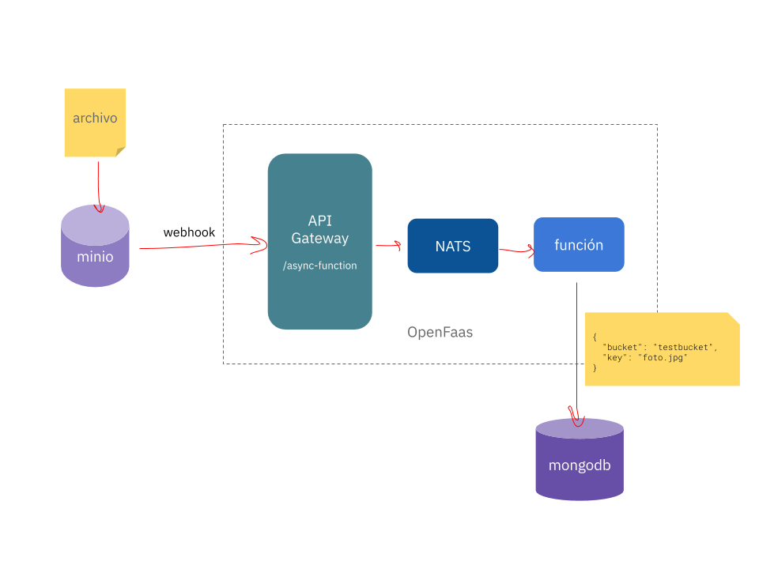

# TP Final



El objetivo es escribir y hacer deployment de una función en **openfaas** que reciba un objeto en formato JSON desde **minio** y lo guarde en una colección en **mongodb**.

## Herramientas

### Instalacion de openfaas

- Realizar la instalacion como fue descripta en el TP4, utilizando Kubernetes (https://docs.openfaas.com/deployment/kubernetes/)
- Utilizar minikube o en su defecto Okteto

### Instalacion de min.io

- Realizar la instalacion sobre docker
    - https://docs.min.io/docs/minio-docker-quickstart-guide.html
- Tener en cuenta las claves utilizadas para luego poder acceder
- Instalar en la máquina local el cliente minio para poder configurar el servidor
    - https://docs.min.io/docs/minio-client-quickstart-guide.html

### Instalacion de mongodb

- Realizar la instalacion tambien sobre docker
    - https://phoenixnap.com/kb/docker-mongodb

## Escribir la funcion

La funcion necesaria debe recibir el evento enviado por minio. El evento tiene la estructura indicada en la documentacion (https://docs.aws.amazon.com/AmazonS3/latest/dev/notification-content-structure.html).

Utilizar el driver de MongoDB correspondiente al lenguaje de programación elegido, para hacer una conexión a la base de datos.

Del objeto recibido, obtener *solamente* el **nombre del bucket** y **key del objeto**, y guardarlo en una colección.

Ejemplo

```json
{
    "bucket": "testbucket",
    "key": "foto.jpg"
}
```

## Configuracion de Notificaciones

- Activar las notificaciones de tipo webhook
    - https://docs.min.io/docs/minio-bucket-notification-guide.html#webhooks
- Apuntar el webhook a la URL asincronica de la función (/async-function)
- Tener en cuenta el acceso al host desde docker
    - https://stackoverflow.com/a/24326540

## Entrega del trabajo

Para aprobar el trabajo, deberá entregar dos capturas de pantalla.

- Una captura mostrando el archivo subido en MinIO Browser.
- Una captura de una consulta a la base mongodb (puede ser con shell o compass), donde se vea el objeto correspondiente al archivo subido.
